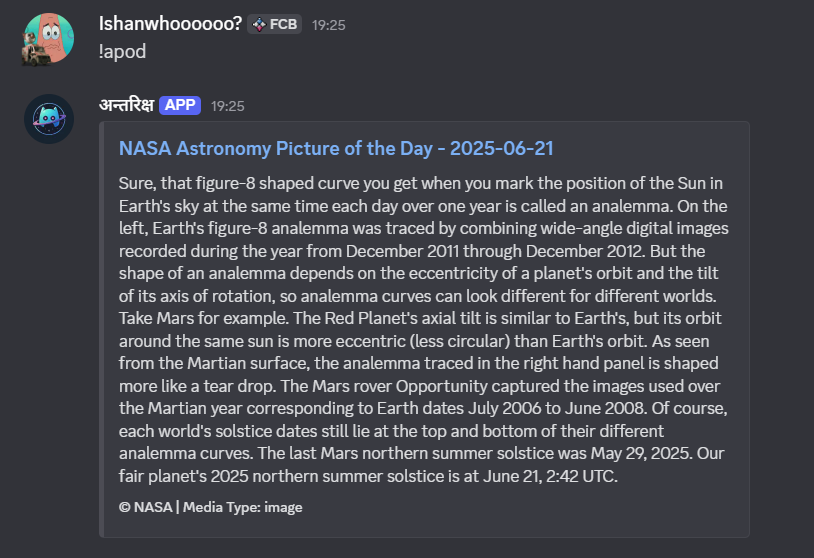
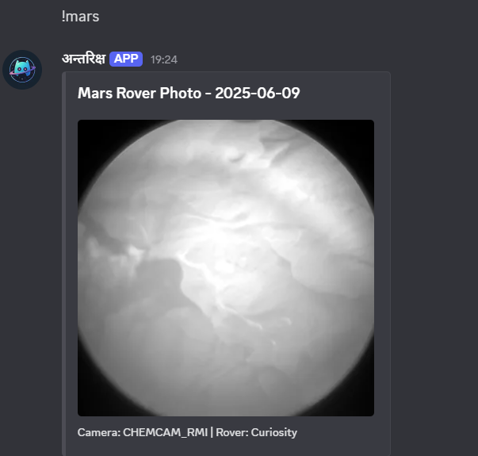
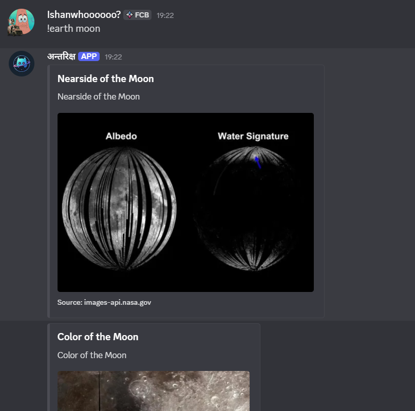
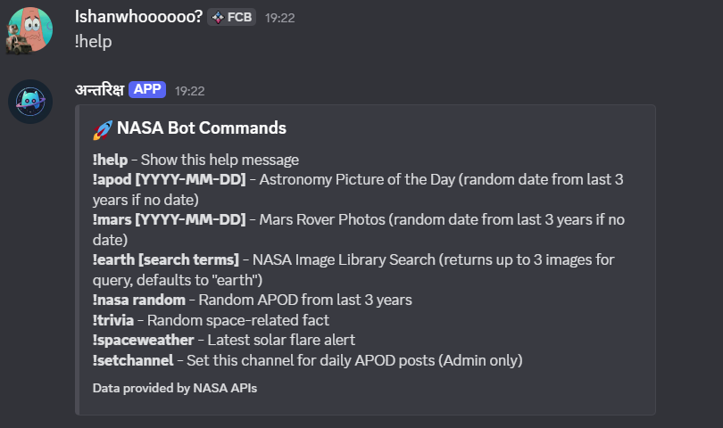

<!-- Bot Logo and Title Section -->
<div align="center" style="margin-bottom: 20px;">
  <table style="border: none; background: transparent;">
    <tr>
      <td style="border: none; background: transparent; vertical-align: middle; padding-right: 24px;">
        
      </td>
      <td style="border: none; background: transparent; vertical-align: middle;">
        <div style="text-align: left;">
          <span style="font-size: 2.2em; font-weight: bold; color: #3b82f6; font-family: 'Segoe UI', 'Arial', sans-serif; letter-spacing: 1px;">🚀 अन्तरिक्ष Discord Bot 🌌</span>
          <br/>
          <span style="font-size: 1.1em; color: #555; font-style: italic;">Explore the universe, one command at a time.</span>
        </div>
      </td>
    </tr>
  </table>
</div>

<!-- Description -->

Welcome to <b>अन्तरिक्ष</b>, your friendly Discord bot for all things space! 🌠 This bot brings the wonders of the universe right to your server, providing stunning images, fascinating facts, and the latest space weather updates from NASA's extensive archives.

## ✨ Features

*   **Astronomy Picture of the Day (APOD):** Get NASA's daily featured image or video, complete with a detailed explanation. You can fetch the picture for a specific date or a random one from the last three years.
*   **Mars Rover Photos:** Explore the Red Planet with images taken by the Curiosity rover. See the Martian landscape from different cameras and on various dates.
*   **NASA Image Library Search:** Delve into NASA's vast collection of images and videos. Search for anything from "black holes" to "earth from space."
*   **Random Space Trivia:** Amaze your friends with interesting, random facts about space and astronomy.
*   **Space Weather Updates:** Stay informed about the latest solar flares and other space weather phenomena.
*   **Customizable Daily APOD:** Set a specific channel on your server to receive the Astronomy Picture of the Day automatically every day.

## 🤖 Bot Invitation Link

Ready to invite अन्तरिक्ष to your server?

**[Click here to invite the bot!](https://discord.com/oauth2/authorize?client_id=1404423838107697301&permissions=75776&integration_type=0&scope=bot)**


## 🔧 Setup & Self-Hosting

Want to run your own instance of the अन्तरिक्ष bot? Follow these steps:

1.  **Clone the Repository:**
    ```bash
    git clone https://github.com/ozaishan/antarikshya.git
    cd antarikshya
    ```

2.  **Install Dependencies:**
    Make sure you have [Node.js](https://nodejs.org/) installed. Then run:
    ```bash
    npm install
    ```

3.  **Create a `.env` file:**
    In the root directory of the project, create a file named `.env`. This file will store your secret keys.

4.  **Get API Keys:**
    *   **Discord Token:**
        1.  Go to the [Discord Developer Portal](https://discord.com/developers/applications).
        2.  Create a "New Application".
        3.  Navigate to the "Bot" tab and click "Add Bot".
        4.  Under the bot's username, click "Reset Token" to reveal your token. Copy this token.
        

    *   **NASA API Key:**
        1.  Go to the [NASA API Portal](https://api.nasa.gov/).
        2.  Fill out the form to generate your free API key.
        3.  Copy the generated API key.

5.  **Populate your `.env` file:**
    Open the `.env` file you created and add your keys in the following format:
    ```env
    DISCORD_TOKEN=YourDiscordBotTokenGoesHere
    NASA_API_KEY=YourNasaApiKeyGoesHere
    ```

6.  **Run the Bot:**
    Once your `.env` file is set up, you can start the bot with:
    ```bash
    node index.js
    ```
    You should see a confirmation message in your console, and the bot will appear as online in your Discord server!

## 🛠️ Commands

Here's a list of all the available commands:

*   `!help`: Displays a list of all commands and their descriptions.
*   `!apod [YYYY-MM-DD]`: Shows the Astronomy Picture of the Day. If no date is provided, a random picture from the last three years is shown.
*   `!mars [YYYY-MM-DD]`: Fetches up to 3 photos from the Mars Curiosity rover for a specific date. If no date is provided, a random date from the last three years is used.
*   `!earth [search terms]`: Searches the NASA Image Library. Defaults to "earth" if no search term is provided and returns up to 3 images.
*   `!nasa random`: Displays a random Astronomy Picture of the Day from the past three years.
*   `!trivia`: Shares a random space-related fact.
*   `!spaceweather`: Provides the latest solar flare alerts.
*   `!setchannel`: (Admin only) Sets the current channel for daily automatic APOD posts.

## 📸 Demo Screenshots

**Astronomy Picture of the Day:**



**Mars Rover Photos:**



**Earth Image Search:**



**Help Command:**



---

We hope you enjoy exploring the cosmos with the अन्तरिक्ष bot! If you have any questions or suggestions, feel free to reach out. Happy stargazing! ✨